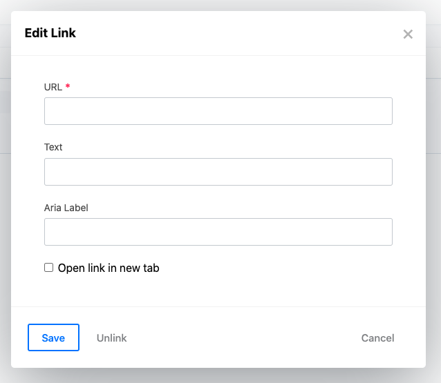

# Redactor Aria Label Plugin for Craft CMS 3

Adds an Aria Label to the Redactor plugin's link module.



## License

This plugin is licensed for free under the MIT License.

## Requirements

Craft CMS 3.0.0 or later.

## Installation

Install the plugin using composer.

```
composer require putyourlightson/craft-redactor-aria-label
```

Created by [PutYourLightsOn](https://putyourlightson.com/).
